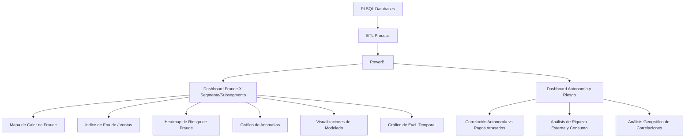

```mermaid
graph TD
A[PLSQL Databases]
B[ETL Process]
C[PowerBI]
D[Dashboard Fraude X Segmento/Subsegmento]
E[Dashboard Autonomía y Riesgo]
F[Mapa de Calor de Fraude]
G[Índice de Fraude / Ventas]
H[Correlación Autonomía vs Pagos Atrasados]
I[Análisis de Riqueza Externa y Consumo]
J[Análisis Geográfico de Correlaciones]
K[Heatmap de Riesgo de Fraude]
L[Gráfico de Anomalías]
M[Visualizaciones de Modelado]
N[Gráfico de Evol. Temporal]
A --> B
B --> C
C --> D
C --> E
D --> F
D --> G
E --> H
E --> I
E --> J
D --> K
D --> L
D --> M
D --> N
```
