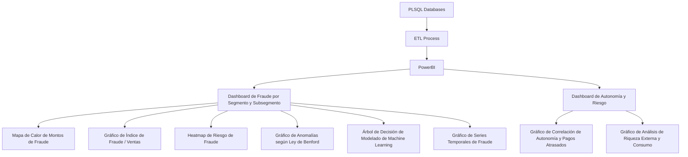

```mermaid
graph TD
A[PLSQL Databases]
B[ETL Process]
C[PowerBI]
D[Dashboard de Fraude por Segmento y Subsegmento]
E[Dashboard de Autonomía y Riesgo]
F[Mapa de Calor de Montos de Fraude]
G[Gráfico de Índice de Fraude / Ventas]
H[Gráfico de Correlación de Autonomía y Pagos Atrasados]
I[Gráfico de Análisis de Riqueza Externa y Consumo]
J[Heatmap de Riesgo de Fraude]
K[Gráfico de Anomalías según Ley de Benford]
L[Árbol de Decisión de Modelado de Machine Learning]
M[Gráfico de Series Temporales de Fraude]
A --> B
B --> C
C --> D
C --> E
D --> F
D --> G
E --> H
E --> I
D --> J
D --> K
D --> L
D --> M
```
